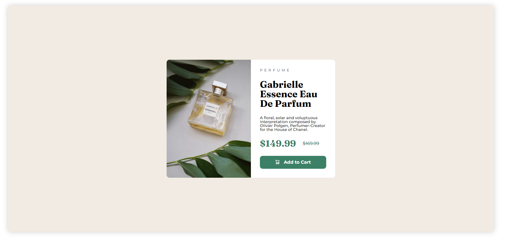
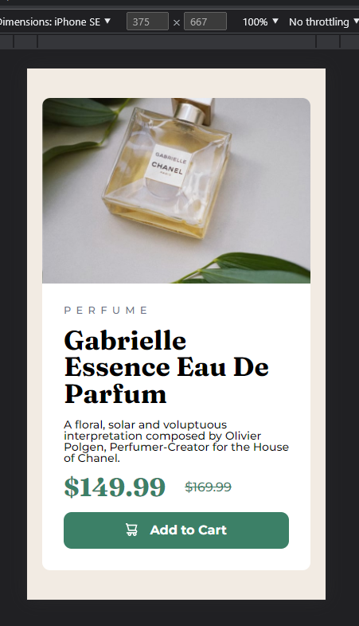

# Frontend Mentor - Product preview card component solution

This is a solution to the [Product preview card component challenge on Frontend Mentor](https://www.frontendmentor.io/challenges/product-preview-card-component-GO7UmttRfa). Frontend Mentor challenges help you improve your coding skills by building realistic projects. 

## Overview

### The challenge

Users should be able to:

- View the optimal layout depending on their device's screen size
- See hover and focus states for interactive elements

### Screenshot

This is the result for desktop resolution.

This is the result for mobile resolution.

### Links

- Solution URL: [Add solution URL here](https://your-solution-url.com)
- Live Site URL: [Add live site URL here](https://your-live-site-url.com)

## My process

Make html structure and css. In fine : responsive thing and optimization of my code.

### Built with

- Semantic HTML5 markup
- CSS custom properties
- Flexbox

### What I learned

Using of Flexbox and em rem and make proportion.